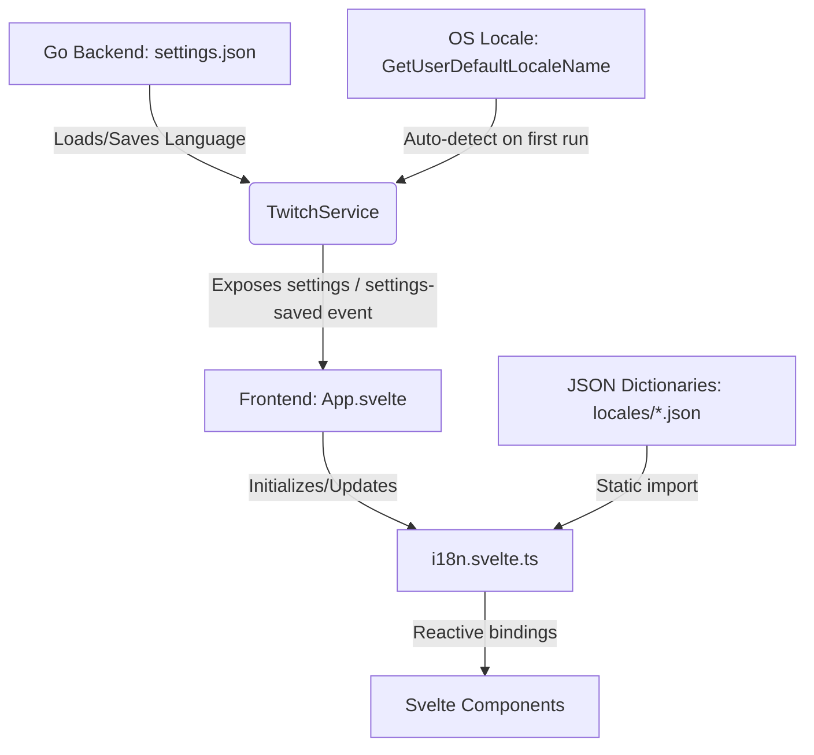

[日本語版 (Japanese)](./i18n_ja.md)

# Multi-language GUI (i18n) Documentation

This document describes the design, implementation, and extension guidelines for the GUI localization (i18n) system in `gnb-twview`.

---

## 1. System Architecture

The localization system spans the Go backend (for persistence and system language detection) and the Svelte 5 frontend (for reactive rendering).



---

## 2. Key Components

### 2.1. Go Backend (Persistence & System Detection)
- **File**: `backend/twitchservice.go`
- **System Language Detection**:
  - The function `getSystemLanguage()` invokes the Windows API `GetUserDefaultLocaleName` to retrieve the OS language profile.
  - If the user's region starts with `"ja"`, it resolves to `"ja"`. Otherwise, it falls back to `"en"`.
- **First-run Logic**:
  - If `settings.json` does not exist or lacks the `language` field, the app detects the system locale, sets it as the default, and saves the file automatically.
- **Bindings**:
  - `GetSettings()` exposes `language` to the frontend as a `string`.
  - `SaveSettings(...)` accepts the `language` configuration, persists it, and broadcasts the updated settings to all open windows via the `settings-saved` event.

### 2.2. Frontend (Reactive Core)
- **File**: `frontend/src/i18n.svelte.ts`
  - Leverages Svelte 5's Rune (`$state`) to declare the `currentLang` variable.
  - Defines the `i18n` state manager with reactive getters and setters. Setting `i18n.lang` instantly triggers re-rendering of all bound components.
  - Utilizes dynamic TypeScript checks (`value in translations`) to ensure seamless scaling when adding new languages.

### 2.3. Dictionary Bundling
- **Directory**: `frontend/src/locales/`
  - Localization profiles are decoupled into standalone `.json` files:
    - [ja.json](file:///D:/Data/Projects/GitHub/gnb-twview/frontend/src/locales/ja.json) (Japanese)
    - [en.json](file:///D:/Data/Projects/GitHub/gnb-twview/frontend/src/locales/en.json) (English)
  - Vite bundles these JSON objects statically, eliminating the need for runtime network fetching.

---

## 3. How to Add a New Language

The localization structure is designed to be fully extensible. To add a new language (e.g., German: `de`):

1. **Create the Translation File**:
   - Create `frontend/src/locales/de.json` by copying `en.json` and translating the values.

2. **Register the Language in Svelte**:
   - Open `frontend/src/i18n.svelte.ts`.
   - Import the new JSON file:
     ```typescript
     import de from "./locales/de.json";
     ```
   - Add it to the `translations` object:
     ```typescript
     export const translations: Record<string, Record<string, string>> = { ja, en, de };
     ```

3. **Update Settings UI**:
   - Open `frontend/src/components/SettingsModal.svelte`.
   - Add the new option to the `<select>` dropdown inside the language settings section:
     ```html
     <option value="de">Deutsch</option>
     ```

No further logic modifications are necessary. The core `i18n.svelte.ts` will automatically resolve keys for `de` and fall back to `en` if any key is missing.
