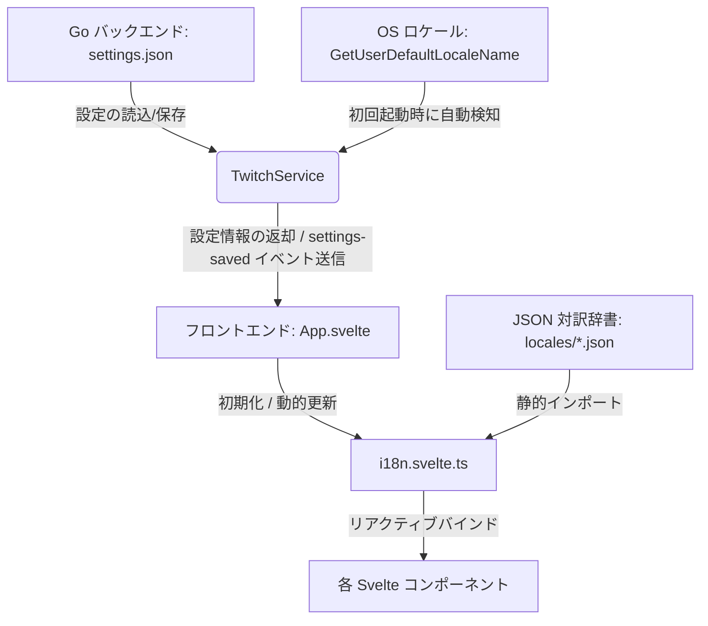

[English Edition](./i18n.md)

# GUI多言語化 (i18n) 仕様・設計ドキュメント

本ドキュメントでは、`gnb-twview` における GUI 表示の多言語化（i18n）システムの設計、実装概要、および言語拡張の手順について解説します。

---

## 1. システム構成

多言語化システムは、設定の永続化とシステム既定言語の判定を担う Go バックエンドと、リアクティブな状態管理によって即座に表示を切り替える Svelte 5 フロントエンドで構成されています。



---

## 2. 主要コンポーネント

### 2.1. Go バックエンド (永続化およびシステム検知)
- **ファイル**: `backend/twitchservice.go`
- **システム言語自動検出**:
  - `getSystemLanguage()` 関数が Windows API の `GetUserDefaultLocaleName` を呼び出し、OS の言語設定を取得します。
  - OS の地域が `"ja"` で始まっている場合は日本語（`"ja"`）、それ以外の場合は英語（`"en"`）をフォールバックとして解決します。
- **初回起動時の初期化**:
  - `settings.json` が存在しない、または `"language"` フィールドが含まれていない場合、システム言語を検知してデフォルト値として設定し、自動保存します。
- **公開バインディング関数**:
  - `GetSettings()` を通じて `language` 情報を文字列としてフロントエンドに返します。
  - `SaveSettings(...)` で設定された `language` を永続化し、最新の設定データを `settings-saved` イベント経由ですべてのウィンドウに同期（ブロードキャスト）します。

### 2.2. フロントエンド (リアクティブコア)
- **ファイル**: `frontend/src/i18n.svelte.ts`
  - Svelte 5 の状態管理 Rune である `$state` を使用して `currentLang` 変数を定義しています。
  - `i18n` ステートマネージャーオブジェクトを提供し、ゲッターおよびセッターをリアクティブ化。`i18n.lang` を書き換えることで、バインドされたすべてのコンポーネントが一斉に再レンダリングされます。
  - セッターでは `value in translations` を用いた動的なチェックを行い、拡張時にコード側の修正が不要な設計にしています。

### 2.3. 対訳辞書ファイル
- **ディレクトリ**: `frontend/src/locales/`
  - 各言語の対訳データは、以下の独立した JSON ファイルとして定義されています。
    - [ja.json](file:///D:/Data/Projects/GitHub/gnb-twview/frontend/src/locales/ja.json) (日本語)
    - [en.json](file:///D:/Data/Projects/GitHub/gnb-twview/frontend/src/locales/en.json) (英語)
  - Vite の静的インポート機能によりビルド時にバンドルされるため、実行時の HTTP リクエスト（非同期 fetch）は不要です。

---

## 3. 言語を追加する手順

本多言語化システムは、簡潔に言語を追加できる設計になっています。例えば、新しくドイツ語（`de`）を追加したい場合は、以下の手順に従います。

1. **翻訳ファイルの作成**:
   - `frontend/src/locales/en.json` をコピーして `frontend/src/locales/de.json` を作成し、各値をドイツ語に翻訳します。

2. **フロントエンドへの登録**:
   - `frontend/src/i18n.svelte.ts` を開きます。
   - 新しい JSON ファイルをインポートします：
     ```typescript
     import de from "./locales/de.json";
     ```
   - `translations` オブジェクトにインポートしたオブジェクトを追加します：
     ```typescript
     export const translations: Record<string, Record<string, string>> = { ja, en, de };
     ```

3. **設定 UI への追加**:
   - `frontend/src/components/SettingsModal.svelte` を開きます。
   - 設定画面の言語選択ドロップダウンメニュー (`<select>`) 内に、新しい言語オプションを追加します：
     ```html
     <option value="de">Deutsch</option>
     ```

以上で新しい言語の追加は完了です。表示処理のロジックを書き換える必要はなく、`i18n.svelte.ts` が自動的にドイツ語のキーを参照し、不足しているキーがあれば自動的に英語（`en`）にフォールバックします。
